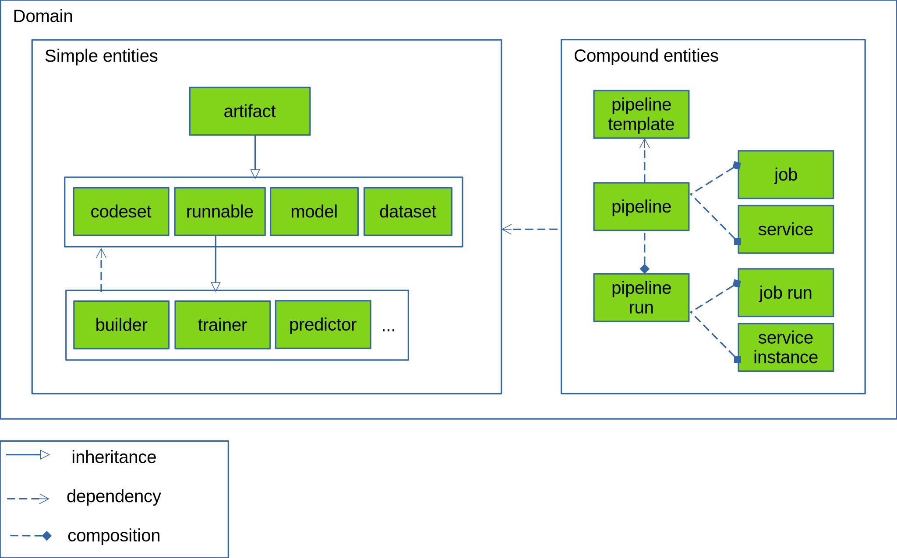

**WIP ---- WIP ---- WIP ---- WIP**

# Guidelines

FuseML follow a combination of design and architecture patterns and best practices:
* [the 12 factor app](https://12factor.net/)
* clean architecture
* domain driven design


# Domain Entities



## Artifacts

Artifacts can be generally described as immutable objects at rest that are either generated by or accepted as input by AI/ML workloads orchestrated by FuseML. They are internally represented by an artifact descriptor which among other things includes an external reference to the service location where the actual artifact contents are stored. Some example of artifacts are: ML models (can be just model definitions or full blown pre-trained models), container images built for various ML operations (data transformation, training, inference serving etc.), ML code components or packages and datasets.

Artifacts have a unique identity and their contents are static. The immutability aspect is vital for features like gitops operations, end-to-end lineage and reproducibility. Artifacts may additionally be referenced using a variety of identification schemes (versioning, tagging, labeling etc.) that don't need to be static (i.e. may change during the lifetime of an artifact). This abstraction should also extend past code and container images and cover the full range of objects involved in AI/ML operations, including but not limited to models and datasets.

Artifacts play another important role in constructing MLOps pipelines: they facilitate composability and reusability. Artifacts act as connection points that enable building a pipeline out of reusable components. Two or more pipeline components can be coupled together to form higher level operational concepts by listing in their definition the type of artifacts that they consume and generate. When artifacts are well described, building complex functional pipelines out of components becomes a simple exercise of matching inputs to outputs.

FuseML must be able to track all artifacts used or generated by AI/ML workloads and define other conventions around artifacts that are needed to implement additional features important from an MLOps workflow perspective. For example:
* searching for artifacts using compatibility filters (e.g. ML models compatible with TensorFlow, predictors compatible with Seldon Core)
* navigating the history of artifacts generated by subsequent runs of the pipeline or runnable that generated them or used them as input

From a design standpoint, artifacts are not operated on directly. All operations applicable to artifacts (e.g. registering, updating, deleting, searching artifacts) are implemented through [Artifact Stores](#ArtifactStores).

Artifacts are further classified into:
* codeset artifacts - the unit of organization for source code
* runnable artifacts - the unit of execution in an MLOps pipeline
* machine learning models
* datasets

### Codeset artifacts

A codeset can be described as a collection of files: code files, scripts, configuration files, generally all the sources needed to implement, build and execute the machine learning logic that goes into the automated ML operations orchestrated by FuseML. It often happens with sample AI/ML applications that datasets and even ML models are grouped and stored alongside regular code and configuration files, but this practice is not advisable, because datasets and ML models represent different categories of AI/ML artifacts, with their own specific lifecycle and operations.

A codeset artifact is an immutable snaphot of a codeset. Even though this is a domain element that should be decoupled from back-end technologies, FuseML makes the assumption that source version control services are used to manage codeset artifacts and therefore relies on representative semantic concepts. From this standpoint, a codeset artifact is uniquely represented by a commit in a git repository. Higher level abstractions such as branches and organizations may be used to implement other FuseML concepts and operations.

### Runnable artifacts

FuseML runnables are the composable, reusable and shareable building blocks used for ML workflow operations. A runnable is represented by an OCI container image paired with one or more FuseML specific descriptors that describe how the container image can be used as a component in the MLOps workflow. Runnables are also one of the most important extensibility mechanisms employed by FuseML to integrate with 3rd party AI/ML tools in a loosely coupled manner.

The complete format of the FuseML runnable descriptor is outside the scope of this document, but some suggestions of fields it should include are given here:
* runnable kind - this field can be used to differentiate between several sub-classes of runnables, each with its own specifics regarding how they are organized and operated on by FuseML or its extensions
* entry point (command, binary or script to execute)
* list of named and typed inputs and outputs. Some possible options are:
  * artifacts or artifact references (e.g. datasets, models, other runnables), optionally accompanied by additional specifiers describing the artifact type, provenance, version etc. Specifiers can be used for example to further filter the artifacts that match the inputs compatible with the runnable, make suggestions about which runnables can be coupled, detect incorrect pipeline setups etc.
  * for input artifacts in particular, the descriptor might include additional details describing statically what constitutes a change (e.g. which files to watch for in an input codeset artifact, which fields to watch for in an input data artifact and which metrics to watch for in an input model artifact)
  * parameters passed by value (e.g. strings, integers, booleans). These can be modeled to take several forms at runtime: 
    * environment variables
    * command line arguments
    * config maps
* resource requirements (ram, cpu, gpu, storage)
* capability requirements (e.g. cpu type, gpu type)

FuseML and its extensions must automatically handle all aspects needed to provide the artifacts used as input by the runnable's container, as well as collect and register the artifacts generated by the container as outputs, in order to isolate the builder's code from the FuseML specific aspects of storing and versioning the artifacts (e.g. clone or copy the git repo/commit, model or dataset into a volume where the container has access).

Examples of kinds of runnable artifacts that could be explicitly modeled as core FuseML concepts are covered in the next sections:
* builders - used to build other runnables out of codeset artifacts 
* trainers - used to train a machine learning model
* predictors - used to run predictions on a pre-trained model

More kinds of runnables will be modeled as they are identified as common patterns that need to be represented as core FuseML concepts, as we integrate additional 3rd party AI/ML tools with FuseML, for example:
* notebook servers - used as development environments
* data transformers - used for data ETL and paired with a feature store
* model validators - used to validate a pre-trained model against test or new data 
* model explainers

#### Builders

Builders are runnables that build other runnables out of codeset artifacts. Builders can themselves be built out of code using other builders and so on, in a recurring manner. FuseML should provide some default builder runnables and conventions that can in turn be used to create other builders specifically designed for 3rd party tools.

What is specific about these runnables:
  * inputs include one (or more) codeset artifact(s)
    * sources to be built into runnables
    * scripts used to build the runnables
    * configuration files controlling how to build the runnables
  * outputs include one or more runnable artifacts
  * other types of artifacts should be allowed as inputs and outputs. For example:
    * a builder might take in an codeset artifact that represents machine learning code bundled together with datasets and models. Aside from a trainer artifact, this builder may create additional dataset artifacts and model artifacts corresponding to those bundled models and datasets.
    * a builder might take in another runnable artifact e.g. if it needs to extend its logic
  * FuseML must facilitate the creation and registration of runnable artifacts by providing one or more of the following
    * CLI
    * SDK libraries
    * container images bundling together the CLI/SDK with other common tools required to define runnables and their software requirements. These container images can be used directly or as base images for tool specific images.
    * automation for building container images: the builder should not be concerned with _building_ container images. It suffices to provide Dockerfiles describing these images and let FuseML take care of all aspects of building, storing, tagging etc. 

Examples of builder artifacts:
1. MLFlow builder - builds trainer and predictor runnables out of an MLFlow project
   * ID: MLFlow project builder
   * inputs:
     * a codeset artifact of type "MLFlow project", with a change filter configured to trigger only when the `conda.yaml` or `MLProject` files change
     * (implicit) a codeset artifact of type "MLFlow builder" - contains the scripts required to build MLFlow runnable artifacts
   * outputs:
     * a trainer artifact of type "MLFLow" (described below)
     * a predictor artifact of type "MLFLow" (described below)
   * OCI container:
     * stock image (or derivation of) provided by FuseML for all builder runnable artifacts, supplying base software requirements (FuseML CLI or SDK library)
   * entry point: the custom builder logic provided with the "MLFlow builder" codeset artifact that leverages the `MLProject` and `conda.yaml` files bundled within the MLFlow codeset artifact:
     * determines if changes from the previous input artifact versions warrant a rebuild of trainer/predictor artifacts (e.g. did the `conda.yaml` file change ? or the builder logic itself ? or was the builder triggered manually or scheduled to run ?) 
     * creates a Dockerfile for the container image used in common by trainer and predictor (installs mlflow and all software requirements specified in `conda.yaml`)
     * uses FuseML CLI/SDK to register the Dockerfile and the descriptors for the two runnables with FuseML
       * the runnables will be tied to the same input codeset artifact of type "MLFlow project" as one used to run the builder
       * the parameters for the training runnable are inferred from the `MLProject` file

   Usage example: whenever a new MLFlow project version is registered as a codeset artifact, the builder is triggered and registers new versions of the "MLFlow" trainer and predictor runnables. FuseML continues the process by rebuilding the container image before recording the new runnables in its database and triggering other workflows that have been affected.

#### Trainers

Trainers are runnables that can be used to train a machine learning model. 

What is specific about these runnables:
  * inputs include:
    * one or more dataset artifact(s) (or zero, if the dataset is included in the container image, in another artifact or obtained through other means that don't involve FuseML)
    * training parameters (can be used to do hyperparameter tuning) 
  * outputs include:
    * one or more model artifacts
    * model metrics
  * other types of artifacts should be allowed as inputs and outputs. For example:
    * a trainer might take in codeset artifacts, for one of these reasons:
      * that's where the dataset or model definition are bundled
      * because the codeset artifact contains other files required for training (e.g. parameters)
      * the training code itself is bundled there (i.e. code doesn't need to be built or packaged, python for example)
    * the trainer may generate one or more datasets (e.g. the processed dataset used for training, the one used for validation) to be used for later reference (e.g. to detect when drifts occur)
  * FuseML must facilitate the creation and registration of model artifacts by providing one or more of the following
    * CLI
    * SDK libraries (e.g. python libraries extending popular machine learning libraries and providing means of storing trained models)

Examples of trainer artifacts:
1. MLFlow trainer - trains a model out of a specific MLFlow project
   * ID: MLFlow trainer for project X
   * inputs:
     * the same codeset artifact of type "MLFlow project" that was used to build this trainer
     * environment variables pointing to the MLFlow instance where experiments are logged (to be determined if and how these are provided)
     * (optional) URL to data
     * training parameters (extracted from the `MLProject` file)
   * outputs:
     * a model of type "MLFLow" (or a model of type "Y" where Y is the ML library used to train and save the model - e.g. sklearn, pytorch, tensorflow)
   * OCI container:
     * custom container image build by the "MLFlow builder" runnable and including all software requirements characteristic to the project
   * entry point: script wrapping `mlflow run`:
     * runs the project (assumes it does training among other things)
     * detects the saved model from the output
     * uses FuseML CLI/SDK to register the model with FuseML
     * alternatively, the MLFlow project code files themselves use the SDK to register the model with FuseML, or FuseML is already integrated with MLFlow by other means and can detect when a model is registered

   Usage example: whenever a new version of the target MLFlow project codeset is registered or when a new trainer version is built, the trainer is triggered to train and register a new version of the model. The trainer can also be triggered to run manually, with different training parameter or with different data.

### Predictors

To be detailed.

## Pipelines

A pipeline is a collection of runnables coupled together into a DAG (direct acyclic graph) workflow by matching together their inputs and outputs. Running a pipeline results in spawning a number of jobs and services that The definition of a pipeline includes the conditions that need to be met for the pipeline run to occur.

Pipelines are the primary consumers of artifacts. If pipeline components can consume inputs from and save outputs to a centralized repository, they no longer have to be tightly coupled together into atomic workflows that depend on eachother at runtime in order to be functional. Pipeline components become standalone functions that can be executed individually. This in turn supports a range of features otherwise not easily achievable:
* running a pipeline step-by-step in a controlled manner (e.g. for debugging purposes)
* dynamically swapping components while a pipeline is running
* resuming a failed pipeline from where it failed instead of running the entire pipeline all over agaoin
* supporting end-to-end MLOps workflows that are not fully automated and need to be split into segments that require some human interaction or external events to continue (e.g. advancing a trained model from development to staging to production)
* running pipeline segments in different infrastructure domains
* scheduling pipeline segments to run at different times to avoid resource contention

Implementing generic pipeline operations without getting locked into a specific 3rd party tool or type of infrastructure requires manipulating artifacts in a generic way, without exposing the core services to implementation specific details such as accessing persistent storage, indexing, searching and caching. This is especially important with 3rd party AI/ML tools that manage their own form of repository for artifacts.

FuseML does not make it mandatory that all steps in a pipeline register their output artifacts with an artifact store through FuseML. In some cases, it is advisable to keep artifacts anonymous, when for example artifacts are not relevant, or when it is not efficient to sync artifacts with a central store due to size concerns. Artifacts can be passed between pipeline components by using local, temporary storage. Lineage and reproducibility features will not be available, but only isolated to the pipeline steps that don't follow this convention. Interoperability (different pipeline steps implemented by different tools) is still achievable with anonymous artifacts, if they are well defined, even if they are not stored, but this still creates additional dependencies between pipeline steps regarding inter-operability and local artifact storage.

# Repositories


## Artifact Store

Artifact stores are FuseML components that group and manage together artifacts of the same type and implement the generic interface defined by FuseML that describes the artifact operations required by FuseML core services. Artifact stores are one of the extensibility mechanisms supported by FuseML. All artifact stores with the exception of those that are built-in (e.g. the gitea application store and the OCI runnable store) should be implemented as independent micro-services - artifact store agents - to enable runtime extensibility. The FuseML design should also allow for multiple artifact stores to be implemented for the same kind of artifact. 

To simplify lifecycle management for artifact store agents, the same mechanisms implemented by FuseML and used for MLOLps could be reused for this extensibility purpose:
* a special type of runnable, similar to a predictor, is used to run artifact store agents, exposing a REST or gRPC API that is consumed by the FuseML core services
* FuseML provides all the items needed to simplify defining and implementing new agent runnables: base classes, wrappers, base container images etc.

Another design assumption that FuseML makes about artifact management in general is that the two parts that make an artifact - the descriptor and the contents - are not necessarily co-located. This assumption is based on several observations:
1. the requirements regarding persistent storage of and, more importantly, access to artifact descriptors are significantly different than those for artifact contents. FuseML core services should rarely need to access the artifact contents, but rely heavily on the information stored in artifact descriptors, whereas for actual AI/ML workloads it's the artifact contents that are important. Solutions oriented predominantly towards file storage (e.g. git servers, S3 storage) may be suitable for artifact contents, which are usually large and/or opaque objects, but they're inadequate for artifact descriptors, which are better stored using solutions that are aware of the semantics involved and can execute server-side operations on the stored data (e.g. a SQL database, or a key-value store).
2. due to the significant size of the artifact contents (e.g. OCI container images, models and datasets), the path they need to take to get between the location where they're stored and the AI/ML workload location where they're consumed or generated should be as short and involve as few intermediary services as possible. Or to formalize: in MLOps, the data path should be used primarily for artifact contents, and the control path should be used for artifact descriptors and other control plane information.
3. one means of facilitating integration between FuseML and external systems is to have FuseML store artifact descriptors that reference artifacts contents stored externally

Having established the distinction between artifact descriptors and artifact contents, the FuseML artifact store components are generally concerned with the following:
1. implements generic operations dealing with artifact descriptors (registering, updating, searching, deleting artifacts)
2. implements persistent storage for artifact descriptors (e.g. in a SQL database or key-value store)
3. registers event hooks and monitors events coming from the storage back-end (e.g. new version of artifact contents published)
4. if needed, the artifact store may interact with the external storage solution used for artifact contents to ensure consistency (e.g. confirm or update versioning, tagging, labeling, metadata where these are supported by the storage solution), delete orphan artifact contents, implement garbage collection etc.

Given FuseML's mission to dynamically integrate with 3rd party AI/ML tools, we'll encounter cases where a 3rd party tool implements its own features related to artifact management, such as storage, tracking, versioning, visualization and so on. In fact, there's a whole category of AI/ML projects with model and/or data versioning listed as their main features (e.g. MLFlow, DVC, Pachyderm, ModelDB, MLRun). When integrating FuseML with such tools, one of the following design patterns can be used to enable FuseML to operate artifacts managed by the 3rd party tool:
1. API adapter - the FuseML artifact store component acts as an API adapter wrapped around the artifact store API exposed by the 3rd party tool. The FuseML artifact store component doesn't store any persistent state related to the 3rd party artifact descriptors. A caching mechanism may be included.
2. API adapter with descriptor storage - this is the API adapter pattern extended to manage its own version of artifact descriptors. The FuseML artifact store stores in its artifact descriptor persistent storage a record of every artifact managed by the 3rd party tool, but doesn't store the artifact contents themselves, it relies on the 3rd party tool to do that. This solution may be required when the 3rd party tool doesn't store enough information or information equivalent to the requirements defined by FuseML regarding artifact descriptors
3. shared back-end storage for artifact contents - FuseML and the 3rd party tool both use the same storage back-end for artifact contents. This is only possible if all the data relevant for FuseML is stored in the back-end by the 3rd party tool, so the 3rd party API can be circumvented.
4. mirror - FuseML keeps a complete copy (contents included) of all artifacts managed by the 3rd party tool. This solution may be particularly useful when artifacts need to be used across kubernetes cluster boundaries and the 3rd party artifact store is only visible inside the cluster.

If FuseML is not the only source of artifacts for a 3rd party store (e.g. 3rd party artifacts can be created by external tools, or by pipeline components directly, without registering them through the FuseML API), then supporting 3rd party artifact stores also needs to be coupled with a mechanism that allows FuseML to be synchronized with the 3rd party tool concerning events that create, modify or delete stored artifacts. This can be done either by ensuring FuseML acts as a proxy for all artifact API operations directed to the 3rd party tool, or implementing a notification and synchronization mechanism that keeps them in sync.

Furthermore, for every flavor of artifact store that FuseML supports, either directly, as a built-in artifact store, or indirectly, through an extension integrating a 3rd party tool, FuseML also needs to facilitate the access path between AI/ML workloads and the artifact contents. This, coupled with the fact that some AI/ML workloads are also managed by 3rd party tools (e.g. for distributed training and prediction serving), seemingly creates a many-to-many adaptation problem that is difficult to solve. In reality, most 3rd party tools dealing with artifact storage provide features that allow artifact contents to be consumed directly from their supported storage backend service. Some notable examples are DVC, Pachyderm and MLFlow, all of which allow translating a dataset or model artifact version into its corresponding location in the back-end storage (e.g. S3 bucket). 

Similarly, most 3rd party tools managing AI/ML workloads are usually integrated with popular object storage services. For every 3rd party artifact store, FuseML only needs to provide the conversion and, optionally, transport of artifacts to and from one of these object storage back-end services. For example, this could take the form of runnables that provide these conversion (and optionally transport) operations, that must be implemented as extensions required for every 3rd party store, that FuseML dynamically and transparently inserts in the pipeline instances depending on the tools that are being used.

For 3rd party artifact stores that don't expose their back-end storage solution, FuseML can employ means of transporting artifacts locally where the AI/ML workloads are located (e.g. into mounted kubernetes volumes), also implemented using 3rd party tool specific runnables.

For visualization and other tool specific features that are not expressed as part of the generic artifact store interface, FuseML should support a redirection mechanism, pointing the user to the 3rd party UI/API. 

Types of artifacts, depending on how they are managed in relation to FuseML:
* internal artifacts: managed by a FuseML artifact store. The FuseML artifact store facilitates, implements or coordinates all operations related to storage, addressing (e.g. versioning, labeling), tracking and consumption (etc. mounting/copying artifacts where workloads can use them as input, providing valid credentials for access etc.). If an external 3rd party artifact store is involved, the FuseML artifact store acts as an intermediary, through the use of tool specific extensions, to hide the implementation specific aspects from the other core services and the machine learning workloads.
* anonymous artifacts: FuseML is not aware of these artifacts. They are either managed directly by 3rd party tools, or being passed directly between pipeline steps (e.g. by means of local temporary storage). 
* external artifacts: artifacts managed externally, by 3rd party tools with which FuseML is otherwise integrated, or by services entirely foreign to FuseML. FuseML may still be able to record external references of these artifacts, but all other operations related to artifact management (e.g. tracking, versioning) are unavailable.

FuseML must define a unified addressing scheme that can be used to identify any artifact regardless of type, tool provenance or storage back-end. It should also provide mechanisms (extensions, adapters, converters, software libraries) to facilitate interoperability in the way AI/ML workloads consume and generate foreign artifacts. For example, a model inference tool should be able to consume a model artifact generated by a training tool even if it doesn't provide built-in compatibility features to support this use-case.

### Codeset Artifact Store

Codeset (formerly _application_) artifacts are organized using generic git concepts: organizations, repositories, branches, tags and commits. A codeset artifact is uniquely identified by a commit number (and the the organization and repository names, without which they don't make sense). 

FuseML ships with a built-in git server (gitea) used to store internal codeset artifacts. 

Integration with external codeset artifacts (e.g. files stored in GitHub or other VCS services) should be supported via 3rd party components that implement the base artifact store interface. External codeset artifacts can also be imported into and regularly synchronized with the internal git server through external means.

### Runnable Artifact Store

The OCI container images associated with FuseML runnables are stored in and managed by FuseML's docker-registry component. References to external OCI container images may also be used, but this cannot be guaranteed to work with FuseML's end-to-end lineage and automation mechanisms.

Q: where does FuseML store the runnable descriptors ? 

### Model Artifact Store

To be detailed.

### Data Artifact Store

To be detailed.

## Pipeline Catalog

## Workload Agents

Runnable artifacts are objects at rest, they embed all the necessary software requirements, configuration files and a description of how they can be executed, but it takes additional information to fully describe the runtime environment and a runtime engine to transform runnables into actual workloads.

In implementing an end-to-end MLOps workflow, FuseML has to orchestrate together types of automated workloads managed by AI/ML tools that are very specific in what they are doing and how they are doing it. Neural architecture search, hyperparameter tuning, distributed training, model inference serving and monitoring are just a few well defined categories of specific AI/ML workloads, and there are many other, more difficult to classify types of workloads and tools listed under AutoML. Runtime agents are services that provide the adaptation layer between the generic AI/ML workload API defined by FuseML and consumed by the core pipeline management services and the more specific 3rd party tools managing those workloads.

Similar to artifact stores, the runtime agent APIs is the demarcation point where the code stops being 3rd party tool agnostic. Runtime agents that are not built-in should be implemented as standalone microservices, using a particular type of runnables.

To simplify lifecycle management for artifact workload agents, the same mechanisms implemented by FuseML and used for MLOps could be reused for this extensibility purpose:
* a special type of runnable, similar to a predictor, is used to run workload agents, exposing a REST or gRPC API that is consumed by the FuseML core services
* FuseML provides all the items needed to simplify defining and implementing new agent runnables: base classes, wrappers, base container images etc.

# Minimal Design

For FuseML to be functional, the following design elements and components are needed at a minimum:
* codesets, runnables and their built-in stores
* pipelines and a pipeline store
* the built-in tekton workload agent and one 3rd party workload agent used for inference serving (e.g. KFServing)


# Use Cases

## End-To-End Pipeline With MLFlow and KFServing


# Questions

- What is the actual expected workflow from user perspective? Are described artefacts visible (and editable) by end user or are there more of an internal concepts? It seems potentially useful to allow users to edit (exchange/plug) various components of the whole workflow, I worry a little bit that it would become overcomplicated.

**A**: the actual workflow can take a variety of forms, involving many actors, from people who only want to be concerned with writing ML code (data scientists), to people who want to customize everything from runnables and pipelines and all the way to writing their own extensions to integrate with additional 3rd party tools. The usual workflow would require FuseML admins to install "extensions" available in some form of marketplace, where an extension bundles together runnables, pipeline templates and workload agents. Regular FuseML users would only use these extensions and pipelines through the CLI and/or UI, so they won't be exposed to the implementation details.

For example, let's say we have a FuseML instance running with the following extensions installed by the admin:
* "MLFlow" providing a runnable and pipeline template for training ML models with MLFlow
* "KFServing" providing a runnable and pipeline template for serving ML models with KFServing

The workflow could be started by an MLOps engineer preparing a FuseML project, consisting of a git organization and a set of attached pipeline templates:

```
fuseml project create myproj
fuseml project set myproj
fuseml pipeline add <mlflow-training-pipeline-template-name> --name training-pipeline --input mlflow_code='code://*'
fuseml pipeline add <kfserving-pipeline-template-name> --name serving-pipeline --input model='model://*'
```
If there's an end-to-end pipeline template available with sane defaults, this could even be shortened to:

```
fuseml codeset push path/to/code --name myapp
fuseml pipeline add <end-to-end-pipeline-template-name> --name full-pipeline --input mlflow_code='code://*'
```

By specifying wildcards for inputs, the pipelines are configured to run automatically for any codesets and models registered within the project.

The Data Scientists can simply publish their MLFlow code to FuseML. Something like this, for example:

```
fuseml project set myproj
fuseml codeset push path/to/code --name myapp
```

FuseML will automatically run all pipelines configured by the MLOps engineer, making sure to maintain lineage according to versioning data, so the results that were produced out of the "current" code version can be shown with e.g.:

```
fuseml pipeline results show --current-code --recursive
Pipeline/Run                     Inputs                                             Outputs
------------                     ------                                             -------
training-pipeline/1              mlflow_code: code://myproj/myapp/f3b0924           model: model://myproj/4c88e8f252be0a8e1e8e3
serving-pipeline/1               model: model://myproj/4c88e8f252be0a8e1e8e3        url: http://myapp.myproj.10.20.30.40.nip.io/predict
                                 predictor: sklearn (default)                       
```

The FuseML CLI can even be made to accept a --wait flag to make it wait until all pipelines directly and indirectly related to the current change have finished running, while at the same time printing information describing the pipeline steps being executed.

The roles may also vary: it can be the DS who is doing everything, from project creation to code publishing.

- I think ideally, user should only provide the input (i.e. codeset) and an action what to do (train/serve/etc.) with various optional arguments. But even for such a simple case (like the MLflow example), the resulting pipeline consists of several, sometimes non-trivial steps. I assume we would need to provide library (store) of such steps (built on top of runnables) that could be used to build whole pipelines. We should allow users to define (register) their own runnables, but it should not be a requirement.

**A**: FuseML needs to provide some "built-in" runnables or steps for common pipeline operations. For example, for handling inputs and outputs (copying/mounting/registering artifacts). We could make FuseML aware of more specific AI/ML concepts like "train" and "serve", which would make it a lot easier for end users to define their workflows, but we should not be exclusive about the type of pipelines that users can run, to ensure extensibility.

- Artefacts like Codeset, Runnable and Pipeline seems to be quite independent in theory and possibly not relying on specific implementation. This seems good at a first glance. However, look how the carrier based fuseml is done - gitea setup provides webhooks which are hooked to Tekton through listener service. Do you expect we build our own listener, actually making fuseml the service that executes the hooks? That might be nice again from the architecture POV, it seems unnecessary to reinvent the wheel again.

**A**: webhooks are required when FuseML isn't explicitly notified about new artifact versions being created. For example, if someone runs `git push` instead of `fuseml push` inside a git repository representing a FuseML codeset, webhooks are needed to notify FuseML about the new codeset version, because `fuseml push` also calls the FuseML API to register the new codeset version. Yes, we can rely on the direct integration between Tekton and gitea through webhooks to trigger pipelines, but the core FuseML service would have no direct visibility into what goes on with the artifacts... unless Tekton communicates this information back to FuseML ?. Tekton webhook integration will be enough for an alpha version. We'll just have to wait and see if we need to build our own webhook listener at some point, especially since the same argument might apply to other types of artifacts (runnables, models, datasets).