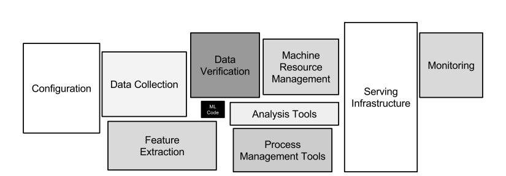
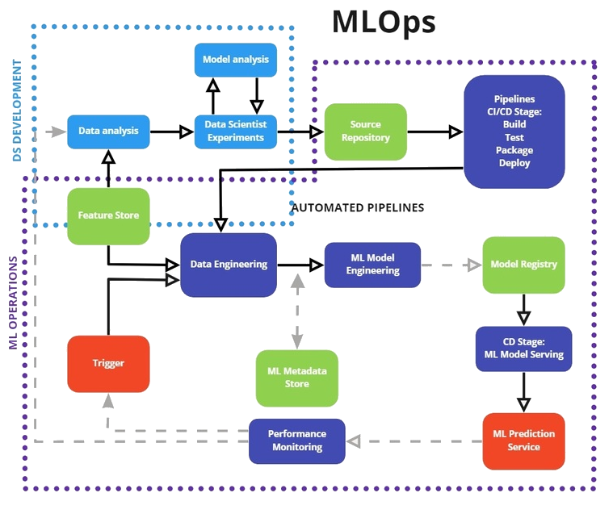
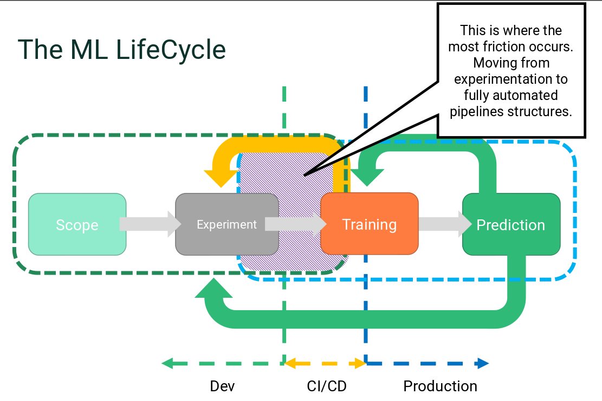

# MLOps Fundamentals and FuseML

MLOps, short for Machine Learning Operations, is a relatively new and trending engineering discipline being developed as a specialized interpretation of the traditional DevOps culture and methodologies aimed at building successful ML production systems. 

This is part of a series of articles that provides a gradual introduction into Machine Learning, MLOps and the [FuseML](https://fuseml.github.io/) project. The [previous episode](fuseml-mlops-episode-one.md) highlighted the main differences between Machine Learning and traditional software and identified some key insights about what makes Machine Learning a unique technology. This article continues the story and shows how those same insights are reflected in the MLOps advocated best practices and adopted in the FuseML project principles.

## More than code in Machine Learning

Some of the seed ideas of MLOps can be traced back to a visionary paper published in 2015 by D. Scully & co. entitled [Hidden Technical Debt in Machine Learning Systems](https://papers.nips.cc/paper/2015/file/86df7dcfd896fcaf2674f757a2463eba-Paper.pdf). The paper points out that the Machine Learning code represents only a small fraction of what is otherwise a vast and complex system of processes.

It is these specialized processes and the information they need to consume and generate that are the main subjects of MLOps. In this section, we explore the main characteristics of those processes.

### Data and ML Models

Using conventional DevOps to develop, deploy and maintain an application in production is usually supported by a continuously calibrated orchestration of objects such as code, configuration, packages, binaries and container images. Applying DevOps to Machine Learning systems requires dealing with new categories of artifacts with specialized behaviors that don't fit the patterns of conventional software engineering. Data and Machine Learning models are two such classes of artifacts that add a new dimension to the project lifecycle. Similar to code and its byproducts, they have to be versioned and stored in specialized repositories, undergo testing, continuous integration and deployment and require specialized monitoring in production.

Adopting data as a project input is particularly challenging. Compared to code, data is more dynamic and unpredictable and is present in almost all stages that an ML system has to go through, from project definition and ML model development to deployment and monitoring. Traditional DevOps may also involve data, but it's usually mainly concerned with code.

MLOps treats Data and Machine Learning models as first class citizens and it outlines the range of specialized activities, mechanisms and software components involved in the orchestration of these ML artifacts throughout the complete lifecycle of ML systems. At a glance, these are:

* code repositories
* model stores
* feature stores
* prediction platforms
* pipeline engines

FuseML is a ML orchestration framework that closely follows the industry standards being developed under MLOps. The concepts and abstractions captured in the FuseML API reflect the known classes of Machine Learning artifacts as well as the specialized categories of tools and operations needed to version, store and process them through the ML project life-cycle stages. Through FuseML and its extensions, AI/ML teams can easily construct a customized ML orchestration platform that they can use to operationalize the lifecycle of their ML projects in conformance with MLOps best practices.

Extensibility is one of the FuseML founding principles. We're constantly adding new concepts and abstractions to the FuseML orchestration API that map to MLOps processes and best practices. This allows more 3rd party AI/ML tools to be included in the ML lifecycle implementation while minimizing technical debt and the risk of vendor lock. 

### Experimentation

The previous article revealed that _ML systems are far less predictable than conventional software_. Especially in cases where the data used to make predictions changes dynamically with time, integration testing can only give limited guarantees that a ML model will yield expected results in production. The techniques of reproducing, investigating and fixing a defective ML model are completely different than those used in traditional software engineering. A classical bug can often be traced back to a few faulty lines of code that can be easily patched and released as an update. Understanding the causes behind an inaccurate set of ML predictions involves the use of specialized tools and techniques and can be as laborious as developing a ML model from scratch.

Another characteristic of Machine Learning directly related to predictibility is that _developing ML systems is iterative, exploratory and experimental_. It often takes a lot of iterations to collect data, to prepare it correctly and to calibrate the ML model parameters to yield satisfactory results. There's experimentation involved in conventional programming too, but to a far less extent, whereas with ML this is more the rule than the exception. Experimentation also doesn't have to stop when a ML model is deployed in production, it's an ongoing process required to ensure that the ML model continues to perform acceptably as the world around it changes.

The need for experimentation means that, depending on the complexity of a project, not every activitiy in the ML lifecycle can be fully automated. Creativity and intuition backed by specialized skills and experience still play an important role in making decisions not only during the development of ML systems, but also during their operation. This makes it difficult to fully automate all segments of the ML development lifecycle. In this situation, the main difficulty in designing an orchestration platform is in maximizing the amount of automation while at the same time facilitating manual intervention and providing seamless integration with non-automated processes.

We designed FuseML as an orchestration framework that has just the right mix of flexibility and automation to meet these challenges. FuseML can be configured to automatically retrain and update a ML model used in production whenever new versions of the data or ML code are published, in a GitOps type of operation. It can also be configured to orchestrate more complex, semi-automated workflows that require users to explicitly forward artifacts between consecutive stages of the ML lifecycle. Flexibility is another one of the FuseML founding principles and the FuseML community is constantly working on adding improvements that help smooth the transition between ML experimentation and ML lifecycle automation.

## Wrap-up

Machine Learning based systems inherit all the challenges and problems related to the development, deployment and maintenance of traditional software. They also exhibit an entirely new range of behaviors and requirements that, when not properly addressed, can result in products that are difficult and costly to maintain over time. The MLOps discipline addresses this by providing recommendations for the development, testing, deployment and maintenance of production grade ML systems.

We interpreted the MLOps industry accepted best practices as guidelines for designing and building a DevOps orchestration solution suitable for Machine Learning systems. The result is FuseML, a flexible and extensible orchestration framework that can be used to streamline the process of continuously deploying Machine Learning systems in production.

In the next article, we'll cover another challenge that organizations and AI/ML teams have to overcome in order to create successful Machine Learning products: the innate differences between science and engineering. We'll also take a closer look at the most common categories of tools required to develop and operate ML systems and we'll uncover two other FuseML principles: openness and collaboration. 
