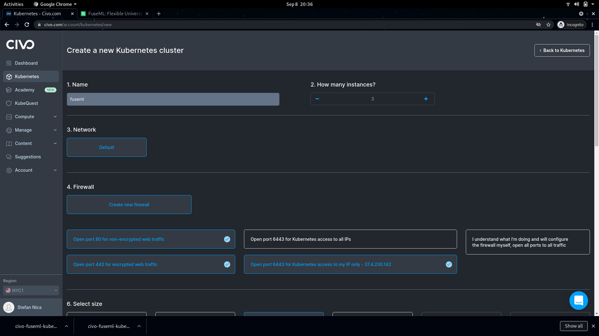
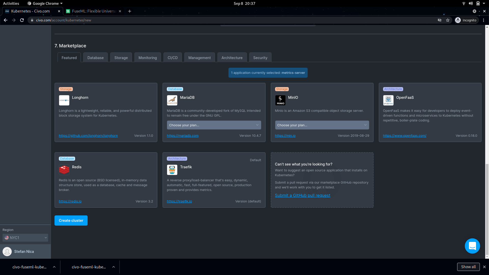
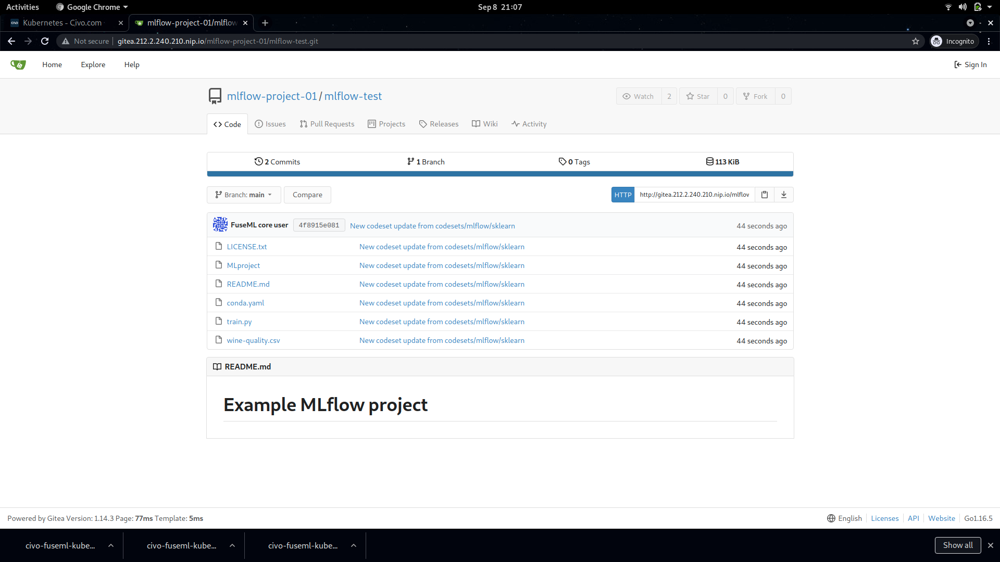
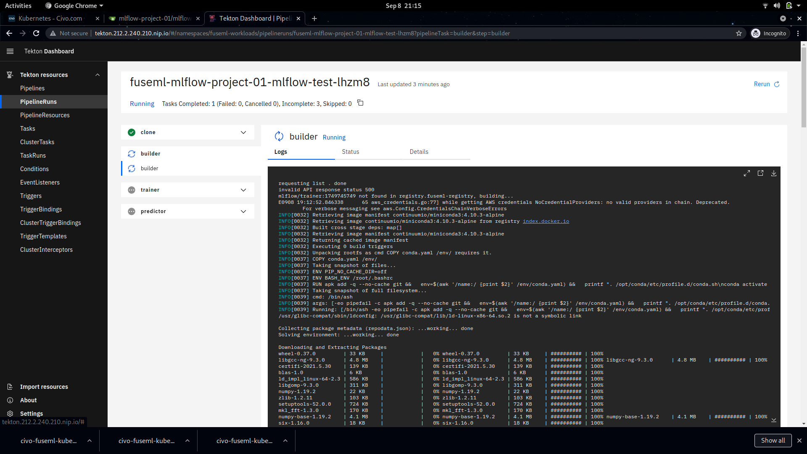
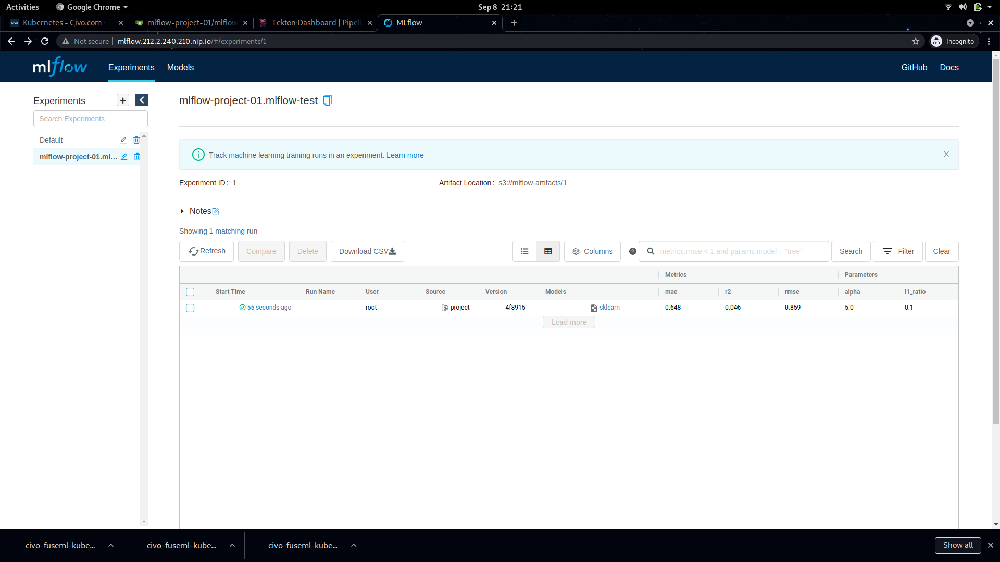
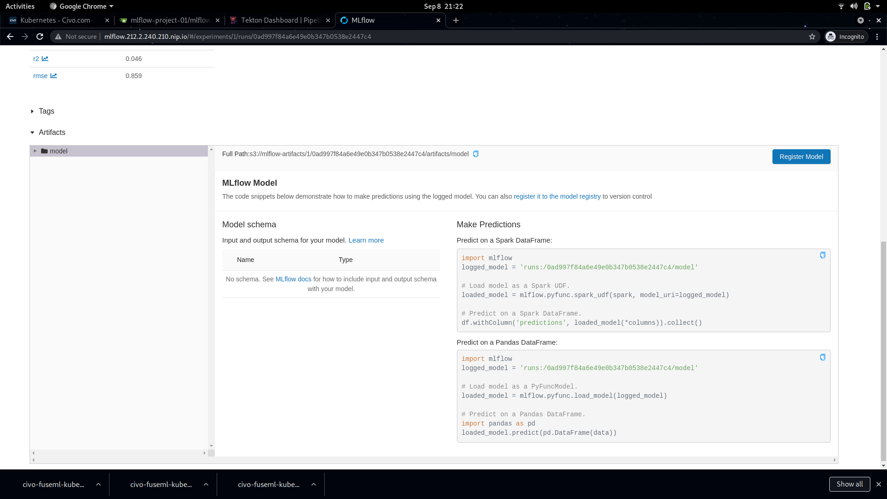
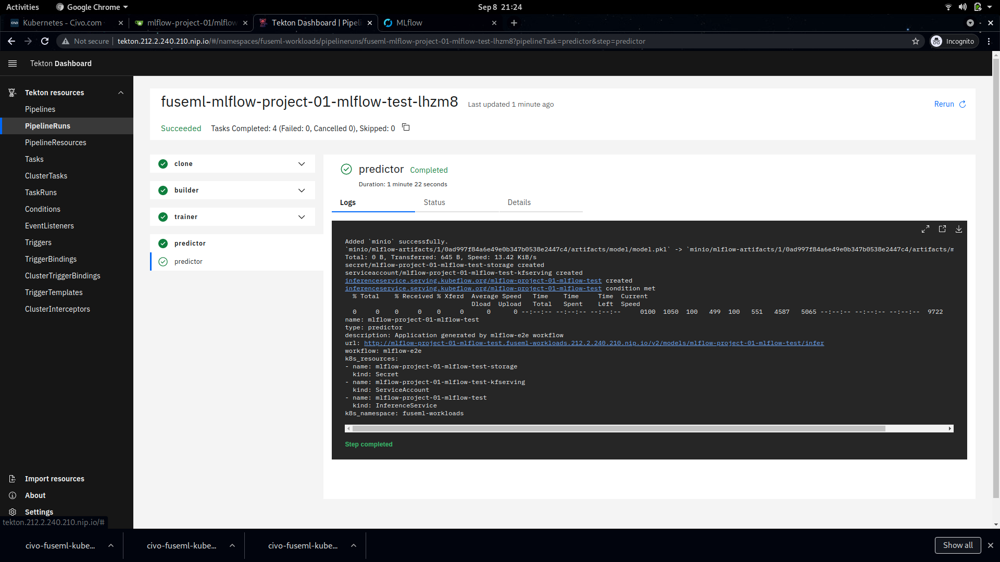
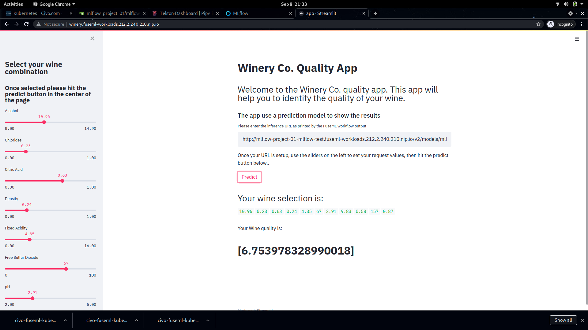

# FuseML 0.2 in a Civo Cluster

## Civo cluster setup

For the purpose of this experiment, I used a Civo cluster with 3 medium sized nodes.
I don't recommend that you go any lower than that, the results might be unexpected and you
might get a lot of undesirable transient timeout errors on the k8s API, as more and more
services are installed in the cluster. 

Remember to disable Traefik as a default service. You also need to open ports 80 and 443
in the Civo cluster firewall to have access to FuseML and the other services.






## FuseML Installation

Check dependencies:

```
snica@aspyre:~/fuseml> kubectl version
Client Version: version.Info{Major:"1", Minor:"18", GitVersion:"v1.18.4", GitCommit:"c96aede7b5205121079932896c4ad89bb93260af", GitTreeState:"clean", BuildDate:"2020-06-22T12:00:00Z", GoVersion:"go1.15.10", Compiler:"gc", Platform:"linux/amd64"}
Server Version: version.Info{Major:"1", Minor:"20", GitVersion:"v1.20.2+k3s1", GitCommit:"1d4adb0301b9a63ceec8cabb11b309e061f43d5f", GitTreeState:"clean", BuildDate:"2021-01-14T23:52:37Z", GoVersion:"go1.15.5", Compiler:"gc", Platform:"linux/amd64"}

snica@aspyre:~/fuseml> helm version
WARNING: Kubernetes configuration file is group-readable. This is insecure. Location: civo-fuseml-kubeconfig
WARNING: Kubernetes configuration file is world-readable. This is insecure. Location: civo-fuseml-kubeconfig
version.BuildInfo{Version:"v3.6.0", GitCommit:"7f2df6467771a75f5646b7f12afb408590ed1755", GitTreeState:"clean", GoVersion:"go1.16.3"}
```

Setup and check access to the Civo cluster:

```
snica@aspyre:~/fuseml> export KUBECONFIG=$PWD/civo-fuseml-kubeconfig 

snica@aspyre:~/fuseml> kubectl get node
NAME                                 STATUS   ROLES    AGE   VERSION
k3s-fuseml-a5eb4a85-node-pool-3dd3   Ready    <none>   98s   v1.20.2+k3s1
k3s-fuseml-a5eb4a85-node-pool-1da5   Ready    <none>   89s   v1.20.2+k3s1
k3s-fuseml-a5eb4a85-node-pool-0586   Ready    <none>   85s   v1.20.2+k3s1
```

Get the latest FuseML installer:

```
snica@aspyre:~/fuseml> curl -sfL https://fuseml.github.io/in/installer.ps1 | sh -
Welcome to FuseML downloader...
starting download...


  % Total    % Received % Xferd  Average Speed   Time    Time     Time  Current
                                 Dload  Upload   Total   Spent    Left  Speed
100   643  100   643    0     0   2041      0 --:--:-- --:--:-- --:--:--  2041
100  9.8M  100  9.8M    0     0  9186k      0  0:00:01  0:00:01 --:--:-- 31.9M
Moving things at their place...
Done.. you may start using Fuseml with: fuseml-installer -h

snica@aspyre:~/fuseml> fuseml-installer version

✔️  Fuseml Installer
Version: v0.2
GitCommit: f238153d
Build Date: 2021-09-08T09:32:36Z
Go Version: go1.16.7
Compiler: gc
Platform: linux/amd64
```

Install FuseML:

```
snica@aspyre:~/fuseml> fuseml-installer install 

🚢 FuseML installing...

Configuration...
  🧭  system_domain: 
  🧭  extension_repository: https://raw.githubusercontent.com/fuseml/extensions/release-0.2/installer/

🚢 Deploying Istio.....
✔️  Istio deployed
.
✔️  Created system_domain: 212.2.240.210.nip.io

🚢 Deploying Workloads...
✔️  Workloads deployed

🚢 Deploying Gitea...............................................................................................................
✔️  Gitea deployed (http://gitea.212.2.240.210.nip.io).

🚢 Deploying Registry.................................................................................
✔️  Registry deployed

🚢 Deploying Tekton...............................................................................................................
✔️  Tekton deployed (http://tekton.212.2.240.210.nip.io).

🚢 Deploying Core......................................................................................
✔️  FuseML core component deployed (http://fuseml-core.212.2.240.210.nip.io).

🚢 Downloading command line client...
🚢 FuseML command line client saved as /home/snica/fuseml/fuseml.
Copy it to the location within your PATH (e.g. /usr/local/bin).

🚢 To use the FuseML CLI, you must point it to the FuseML server URL, e.g.:

    export FUSEML_SERVER_URL=http://fuseml-core.212.2.240.210.nip.io

✔️  FuseML installed.
System domain: 212.2.240.210.nip.io
```

## Run the FuseML Tutorial with MLFlow and KFServing

Following the official FuseML tutorial documented at https://fuseml.github.io/docs/v0.2/tutorials/.

Install the MLFlow and KFServing extensions:

```
snica@aspyre:~/fuseml> fuseml-installer version

✔️  Fuseml Installer
Version: v0.2
GitCommit: f238153d
Build Date: 2021-09-08T09:32:36Z
Go Version: go1.16.7
Compiler: gc
Platform: linux/amd64
snica@aspyre:~/fuseml> fuseml-installer extensions --add mlflow,kfserving

🚢 FuseML handling the extensions...
.
🚢 Installing extension 'mlflow'...
....
✔️  mlflow deployed.

🚢 Registering extension 'mlflow'...

🚢 Installing extension 'knative'...
...............
✔️  knative deployed.

🚢 Registering extension 'knative'...

🚢 Installing extension 'cert-manager'...
........
✔️  cert-manager deployed.

🚢 Registering extension 'cert-manager'...

🚢 Installing extension 'kfserving'...
............
✔️  kfserving deployed.

🚢 Registering extension 'kfserving'...
```

Set up and check FuseML CLI access:

```
snica@aspyre:~/fuseml> export FUSEML_SERVER_URL=http://fuseml-core.212.2.240.210.nip.io
snica@aspyre:~/fuseml> sudo cp fuseml /usr/local/bin
snica@aspyre:~/fuseml> fuseml version
---
client:
  version: v0.2
  gitCommit: 99a8ee08
  buildDate: 2021-09-08T09:34:13Z
  goVersion: go1.16.7
  compiler: gc
  platform: linux/amd64
server:
  version: v0.2
  gitcommit: 99a8ee08
  builddate: 2021-09-08T09:28:11Z
  golangversion: go1.16.7
  golangcompiler: gc
  platform: linux/amd64
```

Fetch the FuseML examples code:

```
snica@aspyre:~/fuseml> git clone --depth 1 -b release-0.2 https://github.com/fuseml/examples.git
Cloning into 'examples'...
remote: Enumerating objects: 28, done.
remote: Counting objects: 100% (28/28), done.
remote: Compressing objects: 100% (24/24), done.
remote: Total 28 (delta 0), reused 22 (delta 0), pack-reused 0
Receiving objects: 100% (28/28), 84.46 KiB | 626.00 KiB/s, done.
snica@aspyre:~/fuseml> cd examples
```

Register the MLFlow project as a codeset:

```
snica@aspyre:~/fuseml/examples> fuseml codeset register --name "mlflow-test" --project "mlflow-project-01" codesets/mlflow/sklearn
2021/09/08 21:06:24 Pushing the code to the git repository...
Codeset http://gitea.212.2.240.210.nip.io/mlflow-project-01/mlflow-test.git successfully registered
Saving new username into config file as current username.
Setting mlflow-test as current codeset.
Setting mlflow-project-01 as current project.
```

Check that the code has been registered and can be accessed in the Gitea UI:



Configure the end-to-end workflow provided as an example:

```
snica@aspyre:~/fuseml/examples> fuseml workflow create workflows/mlflow-e2e.yaml
Workflow "mlflow-e2e" successfully created

snica@aspyre:~/fuseml/examples> fuseml workflow get -n mlflow-e2e
Name:          mlflow-e2e
Created:       2021-09-08T19:09:05Z
Description:   End-to-end pipeline template that takes in an MLFlow compatible codeset,
runs the MLFlow project to train a model, then creates a KFServing prediction
service that can be used to run predictions against the model."


⚓ Inputs

 NAME               TYPE      DESCRIPTION                    DEFAULT
 ∙ mlflow-codeset   codeset   an MLFlow compatible codeset   ---
 ∙ predictor        string    type of predictor engine       auto

📝 Outputs

 NAME               TYPE     DESCRIPTION
 ∙ prediction-url   string   The URL where the exposed prediction service endpoint can b...

🦶 Steps

 NAME          IMAGE
 ∙ builder     ghcr.io/fuseml/mlflow-builder:v0.2
 ∙ trainer     {{ steps.builder.outputs.image }}
 ∙ predictor   ghcr.io/fuseml/kfserving-predictor:0.2

⛩  Workflow Runs

 No workflow runs
```

Assign the codeset to the workflow, which will trigger a workflow run:

```
snica@aspyre:~/fuseml/examples> fuseml workflow assign --name mlflow-e2e --codeset-name mlflow-test --codeset-project mlflow-project-01
Workflow "mlflow-e2e" assigned to codeset "mlflow-project-01/mlflow-test"
```

Monitor the workflow run while it's running:

```
snica@aspyre:~/fuseml/examples> fuseml workflow list-runs --name mlflow-e2e
+--------------------------------------------+------------+----------------+----------+---------+
| NAME                                       | WORKFLOW   | STARTED        | DURATION | STATUS  |
+--------------------------------------------+------------+----------------+----------+---------+
| fuseml-mlflow-project-01-mlflow-test-lhzm8 | mlflow-e2e | 11 seconds ago | ---      | Running |
+--------------------------------------------+------------+----------------+----------+---------+

snica@aspyre:~/fuseml/examples> fuseml workflow list-runs --name mlflow-e2e --format yaml
---
- name: fuseml-mlflow-project-01-mlflow-test-lhzm8
  workflowref: mlflow-e2e
  inputs:
  - input:
      name: mlflow-codeset
      description: an MLFlow compatible codeset
      type: codeset
      default: null
      labels: []
    value: http://gitea.212.2.240.210.nip.io/mlflow-project-01/mlflow-test.git:main
  - input:
      name: predictor
      description: type of predictor engine
      type: string
      default: auto
      labels: []
    value: auto
  outputs:
  - output:
      name: prediction-url
      description: The URL where the exposed prediction service endpoint can be contacted to run predictions.
      type: string
    value: ""
  starttime: 2021-09-08T19:10:52Z
  completiontime: 0001-01-01T00:00:00Z
  status: Running
  url: "http://tekton.212.2.240.210.nip.io/#/namespaces/fuseml-workloads/pipelineruns/fuseml-mlflow-project-01-mlflow-test-lhzm8"
```

In the Tekton UI:



MLFlow is used as an experiment tracking and model store. Model training results can also be accessed using the MLFlow UI:




When the workflow completes successfully, the CLI will show it as `Succeeded`:

```
snica@aspyre:~/fuseml/examples> fuseml workflow list-runs --name mlflow-e2e
+--------------------------------------------+------------+----------------+------------+-----------+
| NAME                                       | WORKFLOW   | STARTED        | DURATION   | STATUS    |
+--------------------------------------------+------------+----------------+------------+-----------+
| fuseml-mlflow-project-01-mlflow-test-lhzm8 | mlflow-e2e | 13 minutes ago | 11 minutes | Succeeded |
+--------------------------------------------+------------+----------------+------------+-----------+
```

And in the Tekton UI:



Retrieve the URL for the prediction service started by the workflow:

```
snica@aspyre:~/fuseml/examples> fuseml application list
+-------------------------------+-----------+----------------------------------------------+--------------------------------------------------------------------------------------------------------------------------+------------+
| NAME                          | TYPE      | DESCRIPTION                                  | URL                                                                                                                      | WORKFLOW   |
+-------------------------------+-----------+----------------------------------------------+--------------------------------------------------------------------------------------------------------------------------+------------+
| mlflow-project-01-mlflow-test | predictor | Application generated by mlflow-e2e workflow | http://mlflow-project-01-mlflow-test.fuseml-workloads.212.2.240.210.nip.io/v2/models/mlflow-project-01-mlflow-test/infer | mlflow-e2e |
+-------------------------------+-----------+----------------------------------------------+--------------------------------------------------------------------------------------------------------------------------+------------+
```

Try running an inference request:

```
snica@aspyre:~/fuseml/examples> export PREDICTOR_URL=$(fuseml application list --format json | jq -r ".[0].url")
snica@aspyre:~/fuseml/examples> curl -d @prediction/data-sklearn.json $PREDICTOR_URL | jq
  % Total    % Received % Xferd  Average Speed   Time    Time     Time  Current
                                 Dload  Upload   Total   Spent    Left  Speed
100   426  100   235  100   191    677    550 --:--:-- --:--:-- --:--:--  1227
{
  "model_name": "mlflow-project-01-mlflow-test",
  "model_version": null,
  "id": "9861d5fc-b8e5-4c5c-82c6-e368a614e16d",
  "parameters": null,
  "outputs": [
    {
      "name": "predict",
      "shape": [
        1
      ],
      "datatype": "FP32",
      "parameters": null,
      "data": [
        6.486344809506676
      ]
    }
  ]
}
```

Deploy the optional web application:

```
snica@aspyre:~/fuseml/examples> kubectl apply -f webapps/winery/service.yaml
service.serving.knative.dev/winery created
snica@aspyre:~/fuseml/examples> kubectl get ksvc -n fuseml-workloads winery
NAME     URL                                                   LATESTCREATED   LATESTREADY    READY   REASON
winery   http://winery.fuseml-workloads.212.2.240.210.nip.io   winery-00001    winery-00001   True    
```

Access and use the web application to make predictions:



